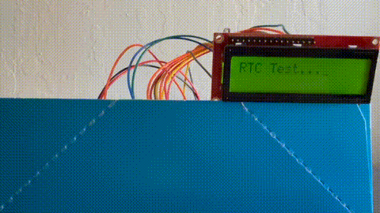
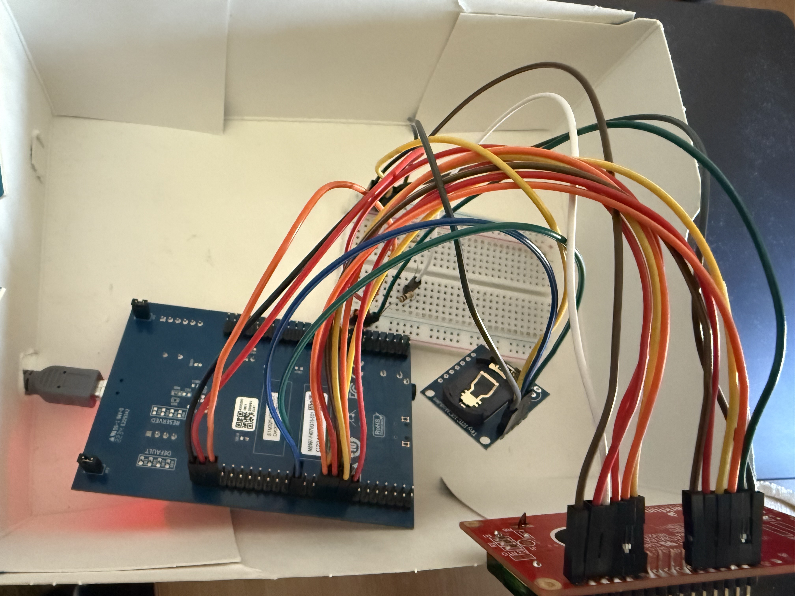

# Embedded C Programming Examples

This repository contains code I developed while practicing embedded programming and some code from following multiple courses by **FastBit Embedded Brain Academy** on Udemy.

The examples include low-level peripheral programming for STM32 microcontrollers, covering GPIO, SPI, I2C, UART, and more using register-level access in C.

## 🧪 Projects

Various embedded systems projects built using STM32 and possibly other microcontrollers. More projects will be added over time.

### 🔷 STM32 Real-Time Clock with LCD Display

Project that uses the DS1307 RTC to display time and date on a character LCD using I2C and GPIO drivers.

**Demo**

**Wiring**

📁 [View Source Code](https://github.com/mdwashi32/embedded/blob/main/target/stm32f4xx_drivers/Src/017rtc_lcd.c)

## Acknowledgments

Some of the source files are based on coursework from the following Udemy courses:

**Courses**: 
- [Microcontroller Embedded C Programming: Absolute Beginners](https://www.udemy.com/course/microcontroller-embedded-c-programming/) — FastBit Embedded Brain Academy
- [Embedded Systems Programming on ARM Cortex-M3/M4 Processor](https://www.udemy.com/course/embedded-system-programming-on-arm-cortex-m3m4/) — FastBit Embedded Brain Academy
- [Mastering Microcontroller with Embedded Driver Development](https://www.udemy.com/course/mastering-microcontroller-with-peripheral-driver-development/) — FastBit Embedded Brain Academy

The code has been written, modified, and organized for educational and personal use.

## License

This repository is licensed under the **GNU Affero General Public License v3.0 (AGPL-3.0)**.

You are free to:
- **Share** — copy and redistribute the material in any medium or format
- **Adapt** — remix, transform, and build upon the material

Under the following terms:
- **Attribution** — You must give appropriate credit and indicate if changes were made.
- **Non-Commercial Use** — You may not use the material for commercial purposes without releasing your modifications under the same license.
- **Copyleft** — If you remix, transform, or build upon the material, you must distribute your contributions under the same AGPL-3.0 license.

See the full license text in the [LICENSE](./LICENSE) file or visit:  
👉 https://www.gnu.org/licenses/agpl-3.0.txt

